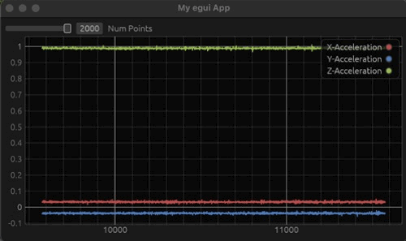

# rust_cpx_accel_rx_tx
Example Rust code to stream and plot accelerometer data from a circuit playground express




## Running Plotting App: 

```
cargo run -- -d /dev/<your tty device>
```

## Flashing the Firmware:

```
cargo hf2 --release
```